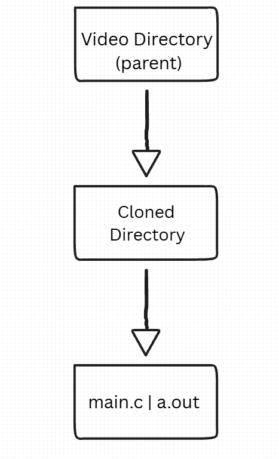

## ffmpeg Commands

mini personal project that performs ffmpeg commands on all video files inside of a directory

### Usage
Make sure ffmpeg is installed and as well as GCC compiler

Make sure the executable is in the right path relative to video directory, 2 levels below video directive (../../)

